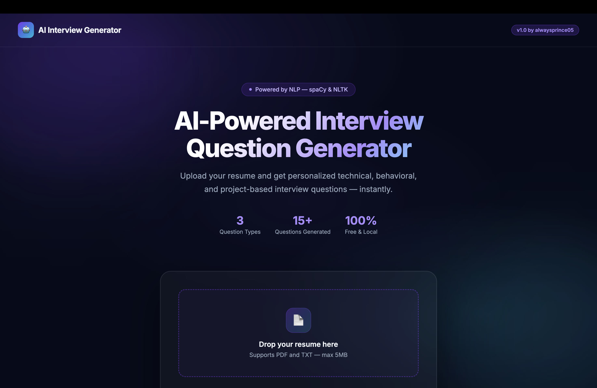

# AI Interview Question Generator — Resume Based

<p align="center">
  
  
  
  
  
</p>

<p align="center">
  <b>Upload your resume → AI reads it → Simulates a real interview in your browser</b>
</p>

---

## Dashboard Preview



---

## About

**AI Interview Question Generator** is a full-stack Python web application that intelligently analyzes a candidate's resume (PDF or TXT) and auto-generates **personalized interview questions** — right in the browser.

It uses **spaCy + NLTK** for NLP-powered resume parsing to extract skills, technologies, experience, and projects, then generates **technical**, **behavioral**, and **project-based** questions tailored to the resume content. The interview is simulated live in a beautiful dark-mode chat interface.

**No paid APIs. No internet required at runtime. 100% free & local.**

---

## Features

- **Drag & Drop Resume Upload** — Supports PDF and TXT (up to 5MB)
- **NLP-Powered Extraction** — spaCy & NLTK extract skills, technologies, experience, projects, and roles
- **Smart Question Generation** — Generates technical, behavioral, and project-based questions from your actual resume content
- **3 Difficulty Levels** — Easy (introductory), Medium (intermediate), Hard (advanced)
- **Live Browser Interview** — Chat-style interface, questions asked one-by-one, type your answers
- **Progress Tracking** — Real-time progress ring, sidebar with detected skills & technologies
- **Full Results Page** — Review all your Q&A pairs with type badges after finishing
- **100% Local** — No paid APIs, no data sent to external servers

---

## Tech Stack

| Layer | Technology |
|---|---|
| Backend | Python, Flask |
| NLP | spaCy (`en_core_web_sm`), NLTK |
| PDF Parsing | pdfminer.six |
| Frontend | HTML5, CSS3 (Glassmorphism + Dark Mode), Vanilla JS |
| Fonts | Google Fonts — Inter |

---

## Project Structure

```
AI-Interview-Question-Generator-Resume-Based-/
│
├── app.py                   # Flask web server — routes & session management
├── main.py                  # Original CLI entry point
├── resume_parser.py         # NLP resume parser using spaCy + regex
├── question_generator.py    # Generates questions by difficulty level
├── interview_engine.py      # Terminal-based interview engine (CLI mode)
├── utils.py                 # Utility helpers (file checks, keyword loaders)
├── requirements.txt         # Python dependencies
├── dashboard.png            # App screenshot
│
├── templates/
│   ├── index.html           # Landing page — upload & difficulty selector
│   ├── interview.html       # Live interview session — chat UI
│   └── results.html         # Results summary page
│
├── static/
│   ├── css/                 # Custom stylesheets
│   └── js/                  # Custom scripts
│
└── uploads/                 # Temporary resume storage (auto-cleaned)
```

---

## Installation

### 1. Clone the repository

```bash
git clone https://github.com/alwaysprince05/AI-Interview-Question-Generator-Resume-Based-.git
cd AI-Interview-Question-Generator-Resume-Based-
```

### 2. Install Python dependencies

```bash
pip install -r requirements.txt
```

### 3. Download spaCy language model *(first run only)*

```bash
python -m spacy download en_core_web_sm
```

### 4. Download NLTK data *(first run only)*

```python
python -c "import nltk; nltk.download('punkt'); nltk.download('averaged_perceptron_tagger')"
```

---

## Running the Web App

```bash
python app.py
```

Then open your browser at:

```
http://127.0.0.1:5000
```

---

## How It Works

```
1. Upload Resume (PDF or TXT)
        ↓
2. spaCy + NLTK extract:
   - Skills (Python, ML, React, etc.)
   - Technologies (Docker, AWS, TensorFlow, etc.)
   - Experience sentences
   - Projects
        ↓
3. QuestionGenerator creates:
   - Technical questions  (per skill/tech)
   - Behavioral questions (per difficulty)
   - Project questions    (per project)
        ↓
4. Browser Interview Simulation
   - Questions shown one-by-one in chat UI
   - You type your answers
   - Skip any question
        ↓
5. Results Page
   - Full Q&A summary
   - Question type badges
   - Stats overview
```

---

## Running in CLI Mode *(original terminal version)*

```bash
python main.py
```

You'll be prompted to:
1. Enter the path to your resume
2. Select difficulty (Easy / Medium / Hard)
3. Answer questions in the terminal

---

## Extending the Project

| File | What to Modify |
|---|---|
| `question_generator.py` | Add new question templates or categories |
| `resume_parser.py` | Improve NLP extraction or add new resume fields |
| `interview_engine.py` | Add scoring, timer, or AI feedback in CLI mode |
| `utils.py` | Add new keyword lists (skills, roles, technologies) |
| `templates/` | Customize the frontend UI |

---

## License

This project is licensed under the **MIT License** — see the [LICENSE](LICENSE) file for details.

---

## Developer

**alwaysprince05**
- GitHub: [@alwaysprince05](https://github.com/alwaysprince05)

---

> *Built with Python, spaCy, NLTK, and Flask*
